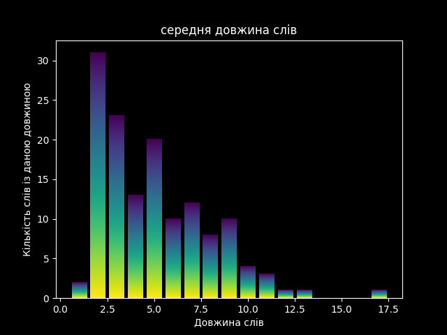
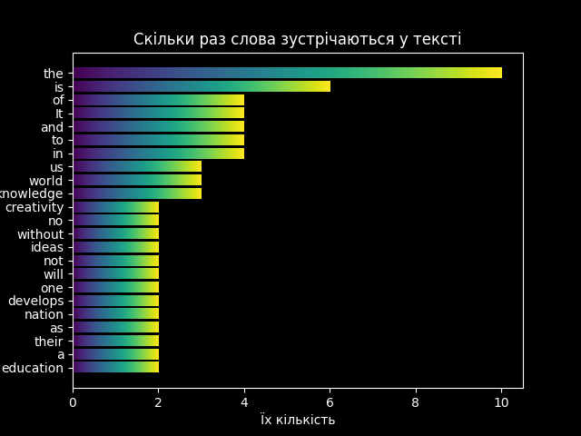
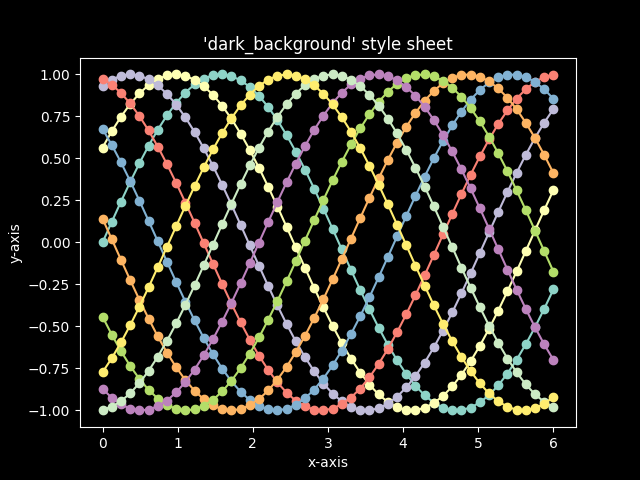
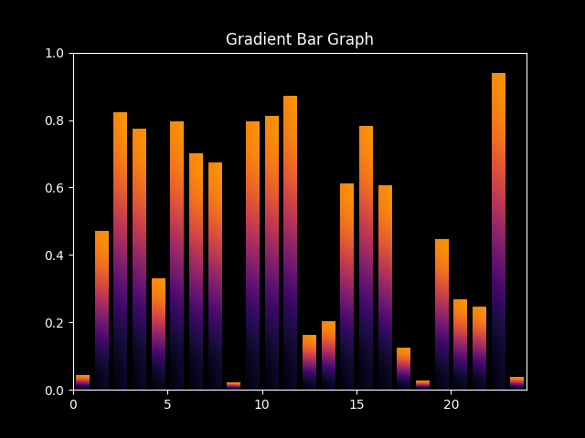
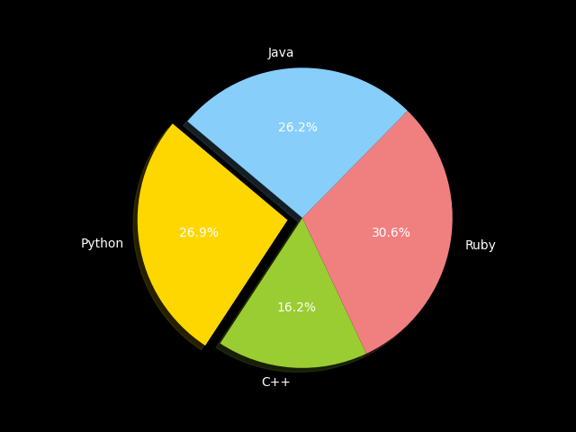
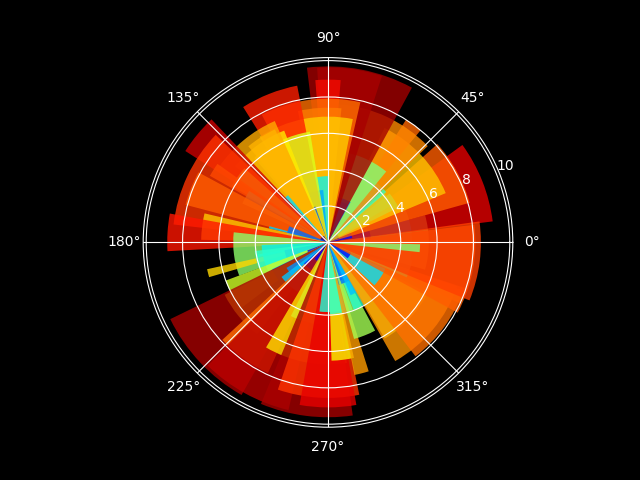
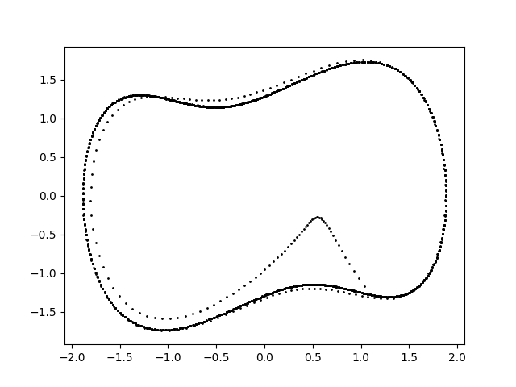
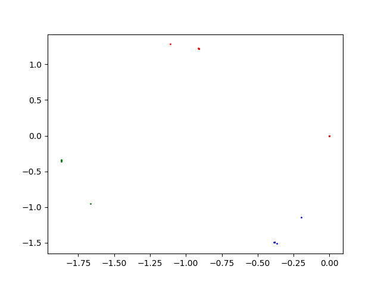
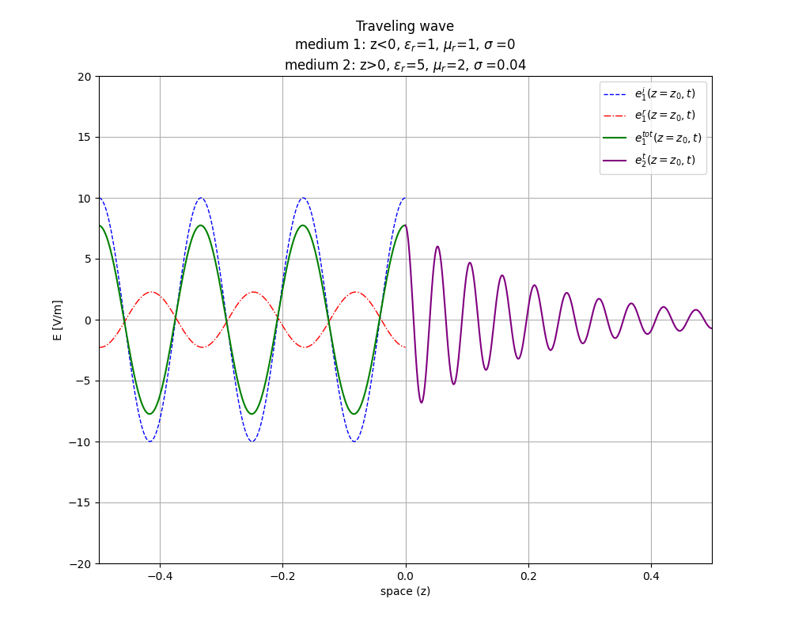

# Python_Math-Physics-Plot
---
## math_1

Проста задачка із інтегралами.

Вивід:
```
Значення інтегралу при x(0.1) = 0.10033433571892295. Похибка за правилом Рунге - 1.113934896756185e-15
Значення інтегралу при x(0.2) = 0.20269897381454494. Похибка за правилом Рунге - 2.250410677967995e-15
Значення інтегралу при x(0.3) = 0.30924829962710493. Похибка за правилом Рунге - 3.433345825721911e-15
Значення інтегралу при x(0.4) = 0.4223975889932355. Похибка за правилом Рунге - 4.689555288464436e-15 
Значення інтегралу при x(0.5) = 0.5449871041836223. Похибка за правилом Рунге - 6.0505723118844645e-15
Значення інтегралу при x(0.6) = 0.6804920647610477. Похибка за правилом Рунге - 7.554979583724283e-15 
Значення інтегралу при x(0.7) = 0.8333040535069683. Похибка за правилом Рунге - 9.251533467169097e-15 
Значення інтегралу при x(0.8) = 1.0091207132779216. Похибка за правилом Рунге - 1.1203490505073095e-14
Значення інтегралу при x(0.9) = 1.2154985146550408. Похибка за правилом Рунге - 1.3494744373677045e-14
Значення інтегралу при x(1.0) = 1.4626517459071815. Похибка за правилом Рунге - 1.623869645314337e-14
```

---
## plots_1

Задача:
Задано текст, обчислити та графічно показати середню довжину слів та слова які найчастіше повторяються, усе красиво оформити.
Графіки:
1. Середня довжина слів:



2. Слова які найчастіше повторяються:



Графіки автоматично зберігаються у файлі "reports" у форматах ".png" та ".pdf", можна змінювати текст у константній змінні на початку та запускати программу зі своїм текстом

---
## plots_2

Задача:
показати основні можливості роботи із графіками у Python, оформити та зберегти фотографії графіків

Графіки:
1. Графік із різною кількість ліній, точок, різними кольорами (створено за допомогою синусоїдальної функції).



2. Стовбцева діаграмма із довільною кількість стовбців та дофільними числами.



3. Секторна(кругова) діаграма із виділеним елементом.



4. Кругова градусна діаграмма (найчастіше використовується для показання сили вітрів з усіх напрямків)



---
## physics_1

Виконування фізичних задач та графічна демонстрація:

1. функція Дюфінга:





2. Хвилі


3. Моделювання удару електромагнітної хвилі.



Вивід:
```
U_1 := σ_1/(ω*ε_0*ε_r_1) = 0  ==> medium 1 is a(n) Insulator
U_2 := σ_2/(ω*ε_0*ε_r_2) = 7.074e-13  ==> medium 2 is a(n) Insulator
μ_eq_1 = 1.257e-06
μ_eq_2 = 2.513e-06
ε_eq_1 = 8.854e-12+0j
ε_eq_2 = 4.427e-11-3.537e-12j
ζ_eq_1 = 376.7+0j
ζ_eq_2 = 237.7+9.48j
k_1 = 37.73+0j
k_2 = 119.4-4.762j
Γ_e = -0.226+0.01892j = 0.2268 ∠ 3.058
τ_e = 0.774+0.01892j = 0.7742 ∠ 0.02443
δ = 0.21
S_i = 0.1327
S_t = 0.1259 = 94.86% S_i
```

4. Розв'язування рівняння тепла.


---

Усі графіки збережено по попках, у кодах можна змінювати значення під свої та запускати программи і отримувати нові графіки.
